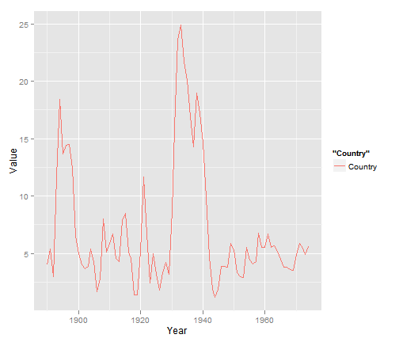
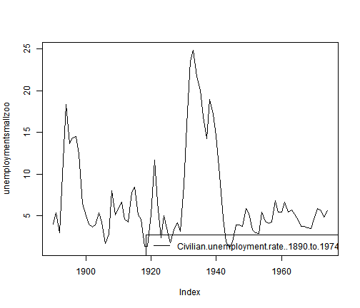
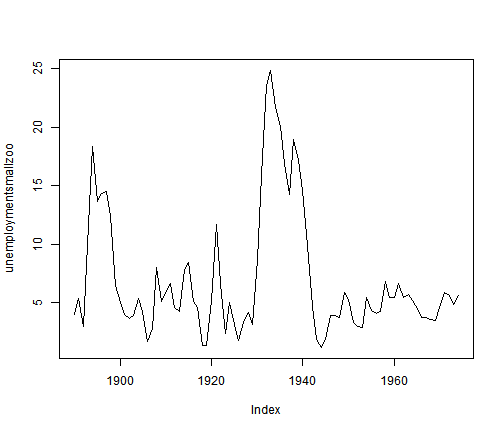

PARTE II

Las primeras instrucciones al igual que en la primera parte


```r
library(ggplot2)
library(tables)
```

```
## Loading required package: Hmisc
```

```
## Loading required package: survival
```

```
## Loading required package: splines
```

```
## Hmisc library by Frank E Harrell Jr
## 
## Type library(help='Hmisc'), ?Overview, or ?Hmisc.Overview') to see overall
## documentation.
## 
## NOTE:Hmisc no longer redefines [.factor to drop unused levels when
## subsetting.  To get the old behavior of Hmisc type dropUnusedLevels().
```

```
## Attaching package: 'Hmisc'
```

```
## The following object(s) are masked from 'package:survival':
## 
## untangle.specials
```

```
## The following object(s) are masked from 'package:base':
## 
## format.pval, round.POSIXt, trunc.POSIXt, units
```

```r
library(knitr)
library(rdatamarket)
```

```
## Loading required package: zoo
```

```
## Attaching package: 'zoo'
```

```
## The following object(s) are masked from 'package:base':
## 
## as.Date, as.Date.numeric
```


A continuación presentaremos datos de la tasa de desempleo civil a nivel mundial para diversos periodos, datos recolectados del sitio de datamarket


```r
unemploymentinfo = dminfo("http://data.is/OjHc61")
unemploymentzoo = dmseries(unemploymentinfo)
unemploymentlist = dmlist(unemploymentinfo)
unemploymentsmalldf = dmlist(unemploymentinfo, Country = c("Colombia", "Mexico", 
    "Venezuela"))
unemploymentsmallzoo = dmseries(unemploymentinfo, Country = c("Colombia", "Mexico", 
    "Venezuela"))
```


Posteriormente presentaré distintos tipos de gráficos sobre el desempleo 


```r
plotunemployment1 = qplot(Year, Value, data = unemploymentsmalldf, geom = "path", 
    colour = "Country")
print(plotunemployment1)
```

 

```r

plot(unemploymentsmallzoo, plot.type = "single", lty = 1:3, col = 1:3)
legend(x = "bottomright", legend = colnames(unemploymentsmallzoo), lty = 1:3, 
    col = 1:3)
```

 

```r
plot(unemploymentsmallzoo, plot.type = "multiple")
```

 


A continuación realizaré el mismo procedimiento pero para una variable distinta, la cual corresponde al nivel de consumo de energia nuclear en Argentina, Brasil y China, por lo tanto tenemos.


```r
nuclearenergyinfo = dminfo("http://data.is/SV29cL")
nuclearenergyzoo = dmseries(nuclearenergyinfo)
nuclearenergylist = dmlist(nuclearenergyinfo)
nuclearenergysmalldf = dmlist(nuclearenergyinfo, Country = c("Argentina", "Brazil", 
    "China"))
nuclearenergysmallzoo = dmseries(nuclearenergyinfo, Country = c("Argentina", 
    "Brazil", "China"))
```


Y ahora los gráficos de series de tiempo para los tres países mencionados


