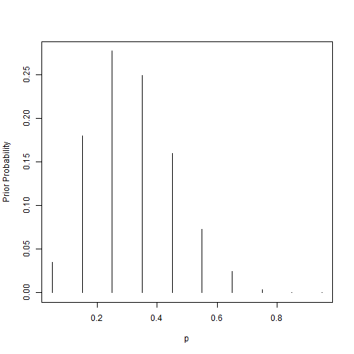
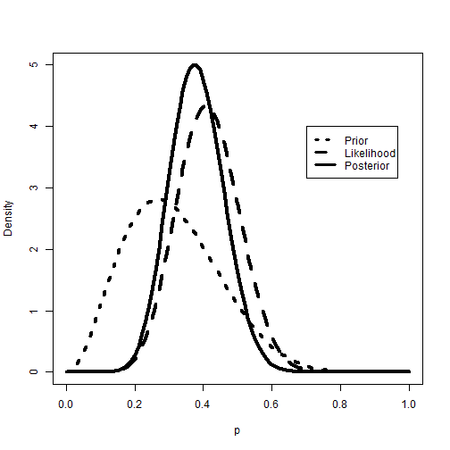
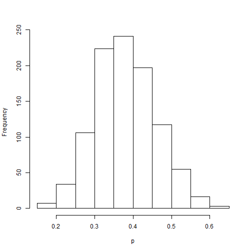

2.3 usando un previo discreto


```r
p = seq(0.05, 0.95, by = 0.1)
prior = c(1, 5.2, 8, 7.2, 4.6, 2.1, 0.7, 0.1, 0, 0)
prior = prior/sum(prior)
plot(p, prior, type = "h", ylab = "Prior Probability")
```

 


Estas son las instrucciones que se usan en el ejemplo del texto de Introducción al pensamiento Bayesiano
En la primera instrucción se genera una secuencia de números desde 0.05 hasta 0.95
Cada término de la secuencia avanza en 0.1, por ejemplo parte de 0.05 y el término siguiente sería 0.15 hasta llegar a 0.95
La segunda instrucción entrega los pesos correspondientes a cada valor de la secuencia antes descrita, que normaliza a probabilidades
Plot sirve para graficar el histograma.
Notar que esta es la parte a priori del ejemplo


```r
data = c(11, 16)
post = pdisc(p, prior, data)
```

```
## Error: no se pudo encontrar la función "pdisc"
```

```r
round(cbind(p, prior, post), 2)
```

```
## Error: objeto 'post' no encontrado
```

```r

library(lattice)
PRIOR = data.frame("prior", p, prior)
POST = data.frame("posterior", p, post)
```

```
## Error: objeto 'post' no encontrado
```

```r
names(PRIOR) = c("Type", "P", "Probability")
names(POST) = c("Type", "P", "Probability")
```

```
## Error: objeto 'POST' no encontrado
```

```r
data = rbind(PRIOR, POST)
```

```
## Error: objeto 'POST' no encontrado
```

```r
xyplot(Probability ~ P | Type, data = data, layout = c(1, 2), type = "h", lwd = 3, 
    col = "black")
```

```
## Error: argumento 'envir' númerico no tiene longitud uno
```


En data indica para el ejemplo que son 11 de 27 estudiantes que duermen al menos 8 horas diarias y los 16 restantes son los que duermen menos de 8 horas diarias
En post damos una función pdisc la cual entrega las probabilidades a posteriori 
Para ocupar pdisc se introducen el vector de proporciones p, el vector de probabilidades a priori y un vector de datos que consiste en s=11 (en este ejemplo) y f=16
cbind se usa para mostrar una tabla de las probabilidades tanto a priori como posteriori 
El comando xyplot es para construir graficos comparativos de linea de la distribución a priori y posteriori.
Se puede notar que la mayoría de la probabilidad posteriori esta concentrada en los valores p=0.35 y p=0.45
Si combinamos las probabilidades por los 3 valores mas probables, podemos decir que la probabilidad posteriori de que p falla en el conjunto {0.25,0.35,0.45} es de 0.94


2.4 Usando un beta a priori

Se habla de un enfoque que consiste en crear una densidad g(p) en el intervalo (0,1) que represente las creencias iniciales de la persona.
g(p)~p^a-1(1-p)^b-1,  0<p<1, los hiperparametros a y b se eligen para reflejar las creencias a priori del usuario


```r
quantile2 = list(p = 0.9, x = 0.5)
quantile1 = list(p = 0.5, x = 0.3)
beta.select(quantile1, quantile2)
```

```
## Error: no se pudo encontrar la función "beta.select"
```


Es más sencillo para obtener a y b indirectamente mediante enunciados sobre los percentiles de la distribución.
La persona cree en este caso que la mediana y el percentil 90 de la proporcion estan dados respectivamente por 0.3 y 0.5
la función beta.select se usa para encontrar la forma de los parametros de la densidad de beta que encaja con este conocimiento a priori
Arriba mostramos comandos de entrada para la función beta.select, quantile1 y 2 definen los dos percentiles a priori y la función regresa los valores de como encaja los parametros beta


```r
a = 3.26
b = 7.19
s = 11
f = 16
curve(dbeta(x, a + s, b + f), from = 0, to = 1, xlab = "p", ylab = "Density", 
    lty = 1, lwd = 4)
curve(dbeta(x, s + 1, f + 1), add = TRUE, lty = 2, lwd = 4)
curve(dbeta(x, a, b), add = TRUE, lty = 3, lwd = 4)
legend(0.7, 4, c("Prior", "Likelihood", "Posterior"), lty = c(3, 2, 1), lwd = c(3, 
    3, 3))
```

 


Se usa el comando dbeta para computar los valores de la verosimilitud a priori y posteriori, la figura muestra que la densidad a posteriori en este caso compromete entre la información de los datos y la información a priori


```r
1 - pbeta(0.5, a + s, b + f)
```

```
## [1] 0.06902
```


Este comando se usa porque es util para ver en este caso si es probable que la proporción p(durmientes pesados) es mayor que 0.5


```r
qbeta(c(0.05, 0.95), a + s, b + f)
```

```
## [1] 0.2555 0.5134
```


Como 0.06 es considerado una probabilidad baja para p. Con el comando anterior se calcula un intervalo de 90% para estimar p mediante computando el percentil 5 y el 95 de la densidad de beta
Existe otro metodo para resumir de una densidad a posteriori esta basada en la simulación. Para el ejemplo se puede simular una gran cantidad de valores desde la densidad a posteriori de beta y resumir el resultado simulado.
con rbeta podemos simular 1000 valores de proporciones aleatorias desde el beta a posteriori (a+s,b+f).


```r
ps = rbeta(1000, a + s, b + f)
```


La probabilidad de que la proporción es mayor a 0.5 es estimado usando la proporción de los valores simulados en este rango. El comando es así


```r
hist(ps, xlab = "p", main = "")
```

 


La probabilidad de que la proporción es mayor a 0.5 es estimado usando la proporción de los valores simulados en este rango. El comando es así


```r
sum(ps >= 0.5)/1000
```

```
## [1] 0.074
```


 un intervalo de 90% puede ser estimado por los cuantiles de muestra de 5th y 95th de la muestra simulada
 
 

```r
quantile(ps, c(0.05, 0.95))
```

```
##     5%    95% 
## 0.2563 0.5139 
```


2.5 usando un histograma a priori
 aunque existen ventajas computacionales para usar un beta a priori, es sencillo para realizar computaciones a posteriori para cualquier elección a priori.
 
Debemos esbozar un metodo de fuerza bruta de un resumen de cálculos a posteriori para una densidad a priori arbitraria digamos g(p)
Los dibujos de las simulaciones resultantes son una muestra aproximada desde una distribución a posteriori.

 se debe ilustrar un algoritmo de fuerza bruta por un histograma a priori que podría reflejar mejor la opinion de la persona a priori sobre la proporción p.
 
 Suponga que es conveniente para declarar la opinion a priori de nuestra persona acerca de la proporción p dividiendo el rango de p en 10 subintervalos.
 
 Después asignar probabilidades a los intervalos.
 La persona en nuestro ejemplo asigna los pesos 1,5.2,8,7.2,4.6,2.1,0.7,0.1,0,0 para estos intervalos. Esto puede ser visto como una versión continua de la discreta a priori usada anteriormente
 Los comando a utilizar son.
 
 

```r
midpt = seq(0.05, 0.95, by = 0.1)
prior = c(1, 5.2, 8, 7.2, 4.6, 2.1, 0.7, 0.1, 0, 0)
prior = prior/sum(prior)
curve(histprior(x, midpt, prior), from = 0, to = 1, ylab = "Prior density", 
    ylim = c(0, 0.3))
```

```
## Error: no se pudo encontrar la función "histprior"
```


Calculamos la densidad a posteriori multiplicando el histograma a priori por la función de verosimilitud.


```r
curve(histprior(x, midpt, prior) * dbeta(x, s + 1, f + 1), from = 0, to = 1, 
    ylab = "Posterior density")
```

```
## Error: no se pudo encontrar la función "histprior"
```


Para obtener una muestra simulada desde una densidad a posteriori mediante nuestro algoritmo, primero construimos una cuadricula igualmente espaciada para los valores de p y calculamos el producto de la función a priori y la verosimilitud en esta cuadrícula.

Después convertimos los productos de la cuadrícula en probabilidades.
 
 

```r
p = seq(0, 1, length = 500)
post = histprior(p, midpt, prior) * dbeta(p, s + 1, f + 1)
```

```
## Error: no se pudo encontrar la función "histprior"
```

```r
post = post/sum(post)
```

```
## Error: objeto 'post' no encontrado
```


Por último, tomamos una muestra con remplazo desde la cuadrícula usando la función.


```r
ps = sample(p, replace = TRUE, prob = post)
```

```
## Error: objeto 'post' no encontrado
```

```r
hist(ps, xlab = "p", main = "")
```

 


2.6 Predicción

 Nos hemos enfocado en aprender acerca de la proporción de la población de p (durmientes pesados).
 
 Suponga que una persona esta interesada también en predecir el número de durmientes pesados ~ en una muestra futura de m=20 estudiantes.
 
 Si las creencias actuales sobre p estan contenidas en la densidad g(p), entonces la densidad de predicción de ~ esta dada por
 f(~y) =  f(~y|p)g(p)dp
 
 Si g es una densidad a priori, entonces nos referimos a esto como la densidad a priori predecida y si g es a posteriori, entonces f es una densidad predicha a posteriori.
 
 Ilustramos los calculos de la densidad predicha usando diferentes formas de densidad a priori descrita en este capitulo.
 
 Suponga que usamos una funcion a priori discreta en donde {pi} representa los posibles valores de la proporción con probabilidades respectivas {g(pi)}.
 
 Sea fB(y|n, p) que denota la densidad de muestreo binomial, dados los valores de la muestra de tamaño n y proporción p

 fB(y|n, p) = nypy(1 ??? p)n???y, y = 0, ..., n.
 Entonces la probabilidad predictiva de ~ sucesos en una muestra futura de tamaño m esta dada por

 f(~y) =sum (fB(~y|m, pi)g(pi))
 Ocuparemos función pdiscp para calcular probabilidades predictivas cuando p esta dado a una distribución discreta.
 
 

```r
p = seq(0.05, 0.95, by = 0.1)
prior = c(1, 5.2, 8, 7.2, 4.6, 2.1, 0.7, 0.1, 0, 0)
prior = prior/sum(prior)
m = 20
ys = 0:20
pred = pdiscp(p, prior, m, ys)
```

```
## Error: no se pudo encontrar la función "pdiscp"
```

```r
round(cbind(0:20, pred), 3)
```

```
## Error: objeto 'pred' no encontrado
```


Vemos del resultado que los números más probables de éxitos en esta futura muestra son y = 5 y ~y = 6.

Suponga en vez de que modelamos nuestras creencias acerca de p usando un beta(a,b) a priori.

 En este caso podemos analiticamente integrar p para obtener una expresión de forma cerrada para la densidad predictiva.

 f(~y) = Int(fB(~y|m, p)g(p)dp)

En donde B(a,b) es la función beta. Las probabilidades predictivas usando la densidad de beta son calculadas usando pbetap.

 Las entradas de esta función son los vectores ab de los parámetros de beta a y, el tamaño de la muestra futura m, y el vector de números de éxitos y.
 
 El resultado es un vector de probabilidades predictivas correspondientes a los valores en y.
 
 Ilustramos este calculo usando beta(3.26,7.19) a priori usado para reflejar las creencias de la persona acerca de la proporción de durmientes pesados.
 
 
 
 


